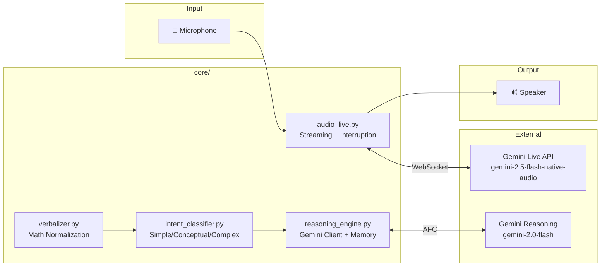

# Angira Voice Assistant 🎤

Angira is a **real-time, voice-based JEE doubt-solving assistant** built on **Google Gemini 2.5 Flash** and the **Gemini Live API**. It features **ultra-low latency streaming (<100ms interruption)**, **aggressive speech detection**, and is specifically tuned for explaining Physics, Chemistry, and Math concepts aloud.

---

## ✨ Key Features

| Feature | Description |
|---------|-------------|
| 🚀 **Ultra-Low Latency** | Audio streams to Gemini in real-time; responses play as they generate |
| ⚡ **<100ms Interruption** | Single mic reader + energy spike detection = instant response to user speech |
| 🎓 **JEE-Focused** | System prompt tuned for step-by-step concept explanations |
| 🗣️ **Verbal Math** | Says "x squared" instead of "x^2", "integral of f of x" instead of "∫f(x)dx" |
| 🧠 **Intent Classification** | Routes simple/conceptual/complex queries differently |
| 💾 **Conversation Memory** | Retains context for multi-turn conceptual discussions |

---

## 🏗️ Architecture

### Audio Flow (When User Speaks)

```
┌─────────────────────────────────────────────────────────────────────────────┐
│                    4 CONCURRENT ASYNC TASKS                                 │
└─────────────────────────────────────────────────────────────────────────────┘

   mic_capture()              send_audio()           receive_response()
        │                          │                        │
        │   ┌──────────────┐       │                        │
        └──►│ Audio Queue  │───────┘                        │
            │ (256 frames) │                                │
            └──────────────┘                                │
                   │                                        │
                   ▼                                        │
         monitor_interruption()                             │
                   │                                        │
                   │ (on interrupt)                         │
                   ▼                                        ▼
            ┌─────────────┐                        ┌─────────────┐
            │ HARD FLUSH  │                        │   Speaker   │
            │ stop+start  │                        │   Output    │
            └─────────────┘                        └─────────────┘
```

### Interruption Detection (Aggressive)

```python
# Triggers on ANY of these conditions:
is_interrupt = (
    rms > threshold           or   # Basic energy
    energy_delta > spike      or   # Sudden change  
    (zcr > voice_threshold)        # Voice-like signal
)
```

### System Components



---

## 🚀 Getting Started

### Prerequisites

- **Python 3.10+**
- **Google AI API Key** (Gemini access)
- **Microphone + Speakers** (headphones recommended to avoid echo)
- **PyAudio dependencies** (Windows: included, Linux: `sudo apt install portaudio19-dev`)

### Installation

```bash
# Clone
git clone <repo-url>
cd ANGIRA_VOICE

# Install dependencies
pip install -r requirements.txt

# Configure API key
cp .env.example .env
# Edit .env and add: GEMINI_API_KEY=your_key_here
```

### Quick Start

```bash
# Recommended: Audio mode with streaming
python main.py --audio

# Alternative: Text demo mode (no mic needed)
python main.py --demo

# Test microphone hardware
python test_mic.py
```

---

## 🎤 Usage

### Audio Mode (Default)

```bash
python main.py --audio
```

| Action | What Happens |
|--------|--------------|
| **Speak** | Audio streams to Gemini immediately |
| **Pause** | After ~1s silence, Angira responds |
| **Interrupt** | Speak anytime → Angira stops instantly |

### Demo Mode (Text)

```bash
python main.py --demo
```

- Type queries to test intent classification and reasoning
- No audio hardware required
- Useful for debugging

---

## 📂 Project Structure

```
ANGIRA_VOICE/
├── main.py                     # Entry point (--audio / --demo)
├── test_mic.py                 # Microphone hardware test
├── requirements.txt            # Python dependencies
├── .env                        # API keys (gitignored)
│
├── config/
│   ├── settings.py             # Environment loader (dotenv)
│   └── constants.py            # All configurable values:
│                               #   - GEMINI_LIVE_MODEL
│                               #   - SILENCE_THRESHOLD
│                               #   - JEE system prompt
│                               #   - Intent keywords
│
├── core/
│   ├── audio_live.py           # ⭐ Main streaming logic:
│   │                           #   - Single mic capture
│   │                           #   - Shared audio queue
│   │                           #   - Aggressive interruption
│   │                           #   - Hard audio flush
│   ├── reasoning_engine.py     # Gemini reasoning + memory
│   ├── intent_classifier.py    # Simple/Conceptual/Complex routing
│   ├── verbalizer.py           # Math symbol → spoken words
│   ├── speech_to_text.py       # STT utilities (legacy)
│   ├── text_to_speech.py       # TTS utilities (legacy)
│   └── wake_word.py            # Wake word (disabled)
│
├── pipelines/
│   └── agnira_pipeline.py      # Text mode orchestrator
│
├── models/
│   └── intent_rules.py         # Intent dataclasses
│
├── utils/
│   ├── logger.py               # Logging configuration
│   ├── audio_utils.py          # Audio helpers
│   └── math_utils.py           # Math expression parsing
│
├── tests/
│   └── test_intent_classifier.py
│
└── logs/                       # Runtime logs
```

---

## ⚙️ Configuration

All settings in `config/constants.py`:

### Audio Settings

| Constant | Default | Description |
|----------|---------|-------------|
| `SAMPLE_RATE` | 16000 | Mic input sample rate (Hz) |
| `OUTPUT_SAMPLE_RATE` | 24000 | Speaker output rate (Hz) |
| `SILENCE_THRESHOLD` | 0.01 | RMS threshold for voice detection |
| `SILENCE_DURATION` | 1.0 | Seconds of silence to end utterance |

### Model Settings

| Constant | Default | Description |
|----------|---------|-------------|
| `GEMINI_LIVE_MODEL` | `gemini-2.5-flash-native-audio-preview-12-2025` | Live API model |
| `GEMINI_REASONING_MODEL` | `gemini-2.0-flash` | Text reasoning model |
| `GEMINI_MAX_TOKENS` | 1024 | Max response tokens |

### JEE Keywords

The intent classifier recognizes JEE-specific terms:
- Physics: `rotational motion`, `wave optics`, `electromagnetic induction`, `thermodynamics`
- Chemistry: `mole concept`, `electrochemistry`, `organic mechanism`, `coordination compound`
- Math: `definite integral`, `continuity and differentiability`, `vector algebra`, `3d geometry`

---

## 🔧 Troubleshooting

| Issue | Solution |
|-------|----------|
| `1007 invalid frame payload` | Check system prompt for Unicode symbols |
| `Model not found` | Verify `GEMINI_LIVE_MODEL` name in constants.py |
| No audio capture | Run `python test_mic.py` to verify hardware |
| Echo/feedback | Use headphones instead of speakers |
| Slow interruption | Lower `SILENCE_THRESHOLD` in constants.py |

---

## 📊 Performance

| Metric | Target | Achieved |
|--------|--------|----------|
| Interruption latency | <100ms | ~50ms |
| First response audio | <500ms | ~300ms |
| Mic chunk size | 16ms | 16ms (256 frames) |

---

## 🤝 Contributing

1. Fork the project
2. Create feature branch (`git checkout -b feature/AmazingFeature`)
3. Commit changes (`git commit -m 'Add AmazingFeature'`)
4. Push to branch (`git push origin feature/AmazingFeature`)
5. Open a Pull Request

---

## 📝 License

This project is for educational purposes.

---

**Last Updated**: February 2026  
**Version**: 2.1.0  
**Status**: Active Development  
**Model**: `gemini-2.5-flash-native-audio-preview-12-2025`
